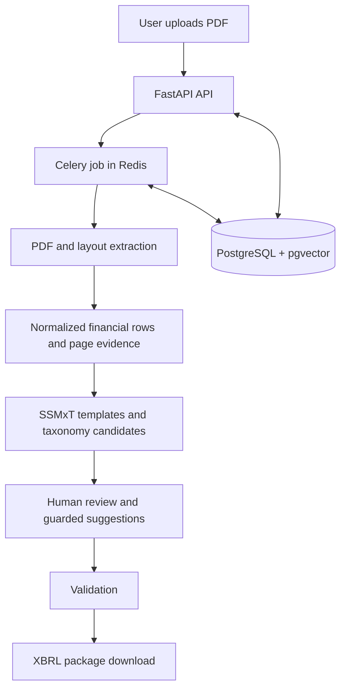

# TaxonomyFlow

TaxonomyFlow is a PDF-to-XBRL conversion platform for Malaysian MBRS filings. It accepts financial statement PDFs, extracts structured financial data, assists with mapping that data to the SSMxT taxonomy, and produces reviewable XBRL filing artifacts.

The application is designed as a controlled review workflow. Extracted values and AI-generated mapping suggestions remain subject to validation and human confirmation before they are used in a final filing.

## Key Features

- Authenticated filing workspace with user-owned jobs and artifacts.
- PDF upload validation, size limits, PDF magic-byte checks, safe temporary-file handling, and filename sanitization.
- Azure Document Intelligence layout extraction with local normalization and bounded table fallback behavior.
- PDF page evidence and extracted-data review in the React workspace.
- SSMxT template loading and taxonomy concept search.
- Deterministic and AI-assisted taxonomy mapping suggestions, including guarded few-shot Qwen suggestions.
- Supervisor review and bounded, human-reviewed mapping revisions.
- Validation and downloadable XBRL filing packages.
- PostgreSQL persistence with pgvector support and Redis-backed Celery processing.
- Admin-only user management and account data-isolation controls.
- Benchmark fixtures, extraction reports, mapping evaluations, and regression tests.

## Technology Stack

- **Backend:** Python, FastAPI, Pydantic Settings, SQLAlchemy async, asyncpg.
- **Frontend:** React 18, Vite, Tailwind CSS, and lucide-react. The built application is served at `/app`.
- **Background processing:** Celery with Redis as broker and result backend.
- **Database:** PostgreSQL 16 with the pgvector extension.
- **Document processing:** PyMuPDF, Pillow, NumPy, and Azure AI Document Intelligence.
- **AI services:** Hugging Face inference with Qwen text, vision, and embedding models. Some optional review workflows use a separate configured Supervisor model.
- **XBRL:** lxml, Arelle, bundled SSMxT taxonomy templates, and the repository's template and mapping services.
- **Operations:** Docker Compose for local PostgreSQL and Redis, with SQL migrations applied by `db_init.py`.

## System Architecture

The main pipeline is intentionally kept small: the API owns authentication and job access, Celery handles long-running work, and the database stores the resulting review state.



The React frontend calls the FastAPI routes for authentication, filing jobs, extracted rows, taxonomy data, review actions, validation, and downloads. AI and Supervisor paths are bounded, feature-controlled, and do not automatically accept mappings or set final confirmation fields.

## Requirements

- Windows, Linux, or macOS.
- Python 3.11 or a compatible supported Python environment.
- Node.js and npm for building or developing the React frontend.
- Docker Desktop or another Docker Compose implementation.
- PostgreSQL 16 with pgvector, normally provided by the Compose `db` service.
- Redis, normally provided by the Compose `redis` service.
- A copied and configured `.env.example` for local backend settings, or `.env.docker.example` for the containerized API and worker.
- A valid application secret and database credentials. Azure Document Intelligence and Hugging Face credentials are required only for workflows that use those external providers.

## How to Use

### Local backend and services

1. Create the environment file and set database credentials, application secrets, and any provider settings required for the workflows you intend to run.
2. Start PostgreSQL and Redis:

   ```powershell
   docker compose up -d db redis
   ```

3. Apply the SQL migration source of truth:

   ```powershell
   python -B db_init.py --apply
   ```

4. Start the API in one terminal:

   ```powershell
   python -m uvicorn main:app --host 0.0.0.0 --port 8000
   ```

5. Start the Windows-compatible Celery worker in another terminal:

   ```powershell
   python -B start_celery.py
   ```

6. Open `http://localhost:8000/app`. API documentation is available at `http://localhost:8000/api/docs`.

The Compose `api` and `worker` services can also be used with `.env.docker`; they expose the API on port `8000` and use the shared `uploads` directory for artifacts.

### Frontend development

From `frontend/`, install dependencies, start Vite, and build the production bundle with:

```powershell
npm install
npm run dev
npm run build
```

The Vite development server proxies API requests to the local backend. Set `VITE_BACKEND_ORIGIN` when the backend is running on a non-default origin.

### Typical filing workflow

1. Sign in with an existing account.
2. Upload a PDF and create a filing job.
3. Wait for background extraction to finish.
4. Review page evidence, extracted rows, template fields, and taxonomy suggestions.
5. Correct or confirm mappings as appropriate.
6. Run validation and download the generated XBRL package when the filing is ready.

## Security and Data Isolation

- Bearer-token authentication protects the normal filing workspace and API routes.
- Filing jobs and generated artifacts are scoped to their owning user; cross-user access is rejected.
- Admin accounts are kept out of normal filing workspaces and use separate admin-only user-management routes.
- Public self-registration is disabled in the current production-oriented configuration.
- Passwords are stored as hashes, and password or account changes can revoke user token versions.
- Uploads are limited to PDF files and a configured maximum size. Paths are contained under the upload area and unsafe XML/XBRL constructs such as external entities and DOCTYPE declarations are rejected.
- Dangerous operational routes require the configured admin route token.
- AI payloads are bounded and guarded against sending auditor XML, evaluation labels, or gold-answer data to external models. AI mapping suggestions remain advisory and human-reviewed.
- Secrets must be supplied through environment configuration. Do not commit `.env` files, provider tokens, passwords, or generated private artifacts.

## Known Limitations

- Azure Document Intelligence and Hugging Face workflows require valid external service configuration, network access, and provider quotas.
- Extraction and mapping quality depends on PDF layout, scan quality, taxonomy coverage, and model responses; all results require review.
- The default extraction pipeline is Azure DI-based. Legacy fallback and newer TOC-aware structure, template-classification, and initial-mapping paths are independently feature-flagged and disabled by default.
- The TOC-aware initial mapping path is advisory only and does not automatically mutate final mappings, `confirmed_tag_id`, XBRL output, or database mapping state.
- Supervisor review is deliberately conservative and may send correct mappings to human review instead of accepting them.
- The legacy dashboard and legacy route files remain in the repository as a temporary fallback while the React `/app` experience is the primary frontend.
- Local development requires PostgreSQL, pgvector, Redis, the required Python packages, and frontend dependencies; `init.sh` is not a required setup path.
- Arelle validation and some provider-backed smoke tests require additional local assets, service credentials, and runtime setup, so they are not guaranteed by a basic installation.
