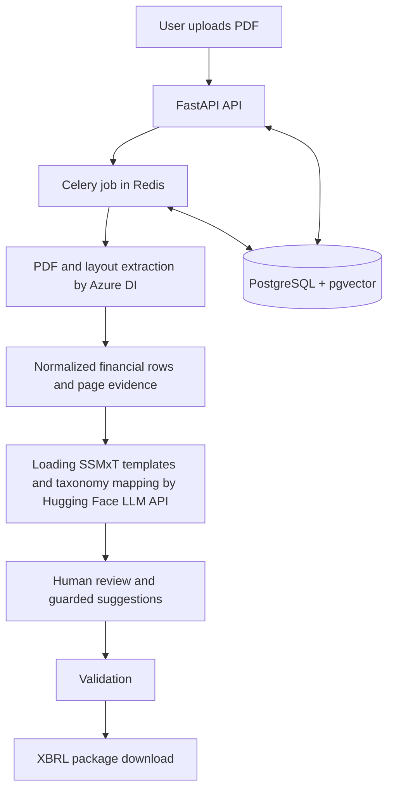

# TaxonomyFlow

TaxonomyFlow is a PDF-to-XBRL conversion platform for Malaysian MBRS filings. It accepts financial statement PDFs, extracts structured financial data, assists with mapping that data to the SSMxT taxonomy, and produces reviewable XBRL filing artifacts.

The application is designed as a controlled review workflow. Extracted values and AI-generated mapping suggestions remain subject to validation and human confirmation before they are used in a final filing.

## Key Features

- Azure Document Intelligence layout extraction with local normalization.
- PDF page evidence and extracted-data review in the React workspace.
- SSMxT template loading and taxonomy concept search.
- Deterministic and AI-assisted taxonomy mapping suggestions, including guarded few-shot AI suggestions.
- Supervisor AI review and human-reviewed mapping revisions.
- Validation and downloadable XBRL filing packages.
- Admin-only user management and account data-isolation controls.

## Technology Stack

- **Backend:** Python, FastAPI, Pydantic Settings, SQLAlchemy async, asyncpg.
- **Frontend:** React 18, Vite, Tailwind CSS, and lucide-react. The built application is served at `/app`.
- **Background processing:** Celery with Redis as broker and result backend.
- **Database:** PostgreSQL 16 with the pgvector extension.
- **Document processing:** Azure AI Document Intelligence.
- **AI services:** Hugging Face inference API.
- **XBRL:** lxml, Arelle, bundled SSMxT taxonomy templates, and the repository's template and mapping services.

## System Architecture



## Requirements

- Python 3.11 or a compatible supported Python environment.
- Node.js and npm for building or developing the React frontend.
- Docker Desktop or another Docker Compose implementation.
- PostgreSQL 16 with pgvector, normally provided by the Compose `db` service.
- Redis, normally provided by the Compose `redis` service.
- A copied and configured `.env.example` for local backend settings, or `.env.docker.example` for the containerized API and worker.
- Azure Document Intelligence API Key & Endpoint
- Hugging Face API Key

## How to Use

### Local backend and services

1. Create the environment file and set database credentials, application secrets, and any provider settings required for the workflows.
2. Start PostgreSQL and Redis:

   ```powershell
   docker compose up -d db redis
   ```

3. Apply the SQL migration source of truth:

   ```powershell
   python -B db_init.py --apply
   ```

4. Start the API in one terminal:

   ```powershell
   python -m uvicorn main:app --host 0.0.0.0 --port 8000
   ```

5. Start the Windows-compatible Celery worker in another terminal:

   ```powershell
   python -B start_celery.py
   ```

6. Open `http://localhost:8000/app`. API documentation is available at `http://localhost:8000/api/docs`.

The Compose `api` and `worker` services can also be used with `.env.docker`; they expose the API on port `8000` and use the shared `uploads` directory for artifacts.

### Frontend development

From `frontend/`, install dependencies, start Vite, and build the production bundle with:

```powershell
npm install
npm run dev
npm run build
```

The Vite development server proxies API requests to the local backend. Set `VITE_BACKEND_ORIGIN` when the backend is running on a non-default origin.

### Typical filing workflow

1. Register an account through the user management console.
2. Sign in with the registered account.
3. Upload an annual financial PDF to create a filing job.
4. Wait for background AI extraction to finish.
5. Review page evidence, extracted rows, template fields, and taxonomy AI suggestions.
6. Correct or confirm taxonomy mappings as appropriate.
7. Run final validation and download the generated XBRL package.

## Security and Data Isolation

- Bearer-token authentication protects the normal filing workspace and API routes.
- Filing jobs and generated artifacts are scoped to their owning user; cross-user access is rejected.
- Admin accounts are kept out of normal filing workspaces and use separate admin-only user-management routes.
- Public self-registration is disabled.
- Passwords are stored as hashes, and password or account changes can revoke user token versions.
- Uploads are limited to PDF files and a configured maximum size. Paths are contained under the upload area and unsafe XML/XBRL constructs such as external entities and DOCTYPE declarations are rejected.
- Dangerous operational routes require the configured admin route token.
- AI payloads are bounded and guarded against sending auditor XML, evaluation labels, or gold-answer data to external models. AI mapping suggestions remain advisory and human-reviewed.
- Secrets must be supplied through environment configuration.
